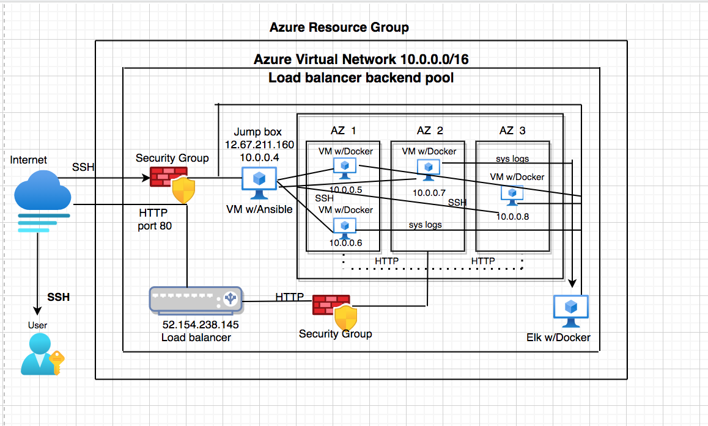
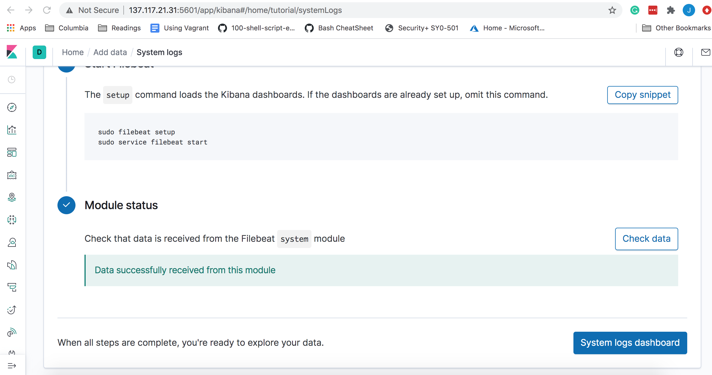

## Automated ELK Stack Deployment

The files in this repository were used to configure the network depicted below.

These files have been tested and used to generate a live ELK deployment on Azure. They can be used to either recreate the entire deployment pictured above. Alternatively, select portions of the _yml____ file may be used to install only certain pieces of it, such as Filebeat.

  - _TODO: Enter the playbook file: /etc/filebeat/filebeat-config.yml

This document contains the following details:
- Description of the Topologu
- Access Policies
- ELK Configuration
  - Beats in Use
  - Machines Being Monitored
- How to Use the Ansible Build

### Description of the Topology

The main purpose of this network is to expose a load-balanced and monitored instance of DVWA, the D*mn Vulnerable Web Application.

Load balancing ensures that the application will be highly __available___, in addition to restricting __traffic___ to the network.
- _TODO: What aspect of security do load balancers protect? What is the advantage of a jump box?_
Load balancers protects the system from DDoS attacks by shifting attack traffic. The advantage of a jump box is to give access to the user from a single node that can be secured and monitored.

Integrating an ELK server allows users to easily monitor the vulnerable VMs for changes to the _logs____ and system _traffic____.
- _TODO: What does Filebeat watch for?_
Filebeat monitors the log files or locations that you specify, collects log events, and forwards them either to Elasticsearch or Logstash for indexing.

- _TODO: What does Metricbeat record?_
Metricbeat takes the metrics and statistics that it collects and ships them to the output that you specify, such as Elasticsearch or Logstash.

The configuration details of each machine may be found below.
_Note: Use the [Markdown Table Generator](http://www.tablesgenerator.com/markdown_tables) to add/remove values from the table_.

| Name     | Function | IP Address | Operating System |
|----------|----------|------------|------------------|
| Jump Box | Gateway  | 10.0.0.4   | Linux            |
| VM1      | Server   | 10.0.0.5   | Linux            |
| VM2      | Server   | 10.0.0.6   | Linux            |
| Elk      | Server   | 10.2.0.4   | Linux            |

### Access Policies

The machines on the internal network are not exposed to the public Internet. 

Only the _Jump Box____ machine can accept connections from the Internet. Access to this machine is only allowed from the following IP addresses:
- _TODO: Add whitelisted IP addresses_
Home IP

Machines within the network can only be accessed by _Jump Box Virtual machine____.
- _TODO: Which machine did you allow to access your ELK VM? What was its IP address?_
Jump Box VM: VNET IP 10.0.0.4

A summary of the access policies in place can be found in the table below.

| Name     | Publicly Accessible | Allowed IP Addresses |
|----------|---------------------|----------------------|
| Jump Box | Yes                 | Home IP              |
| VM1      | No                  | 10.0.0.4             |
| VM2      | No                  |  10.0.0.4            |
| Elk      | No                  | 10.0.0.4             |

### Elk Configuration

Ansible was used to automate configuration of the ELK machine. No configuration was performed manually, which is advantageous because...
- _TODO: What is the main advantage of automating configuration with Ansible?_
You can put commands into multiple servers from one playbook

The playbook implements the following tasks:
- _TODO: In 3-5 bullets, explain the steps of the ELK installation play. E.g., install Docker; download image; etc._
- Install: docker.io
- Install: python-pip
- Install: docker
- Command: sysctl -w vm.max_map_count=262144
- Launch docker container: elk

The following screenshot displays the result of running `docker ps` after successfully configuring the ELK instance.

### Target Machines & Beats
This ELK server is configured to monitor the following machines:
- _TODO: List the IP addresses of the machines you are monitoring_
VM1 10.0.0.5
VM2 10.0.0.6

We have installed the following Beats on these machines:
- _TODO: Specify which Beats you successfully installed_
Filebeat
Metricbeat

These Beats allow us to collect the following information from each machine:
- _TODO: In 1-2 sentences, explain what kind of data each beat collects, and provide 1 example of what you expect to see. E.g., `Winlogbeat` collects Windows logs, which we use to track user logon events, etc._
Winlogbeat collects Windows logs, which we use to track user logon events, etc. Filebeat collects the changes done (Images/Filebeat). Metric beat collects metrics and statistics (Images/Metricbeat)

### Using the Playbook
In order to use the playbook, you will need to have an Ansible control node already configured. Assuming you have such a control node provisioned: 

SSH into the control node and follow the steps below:
- Copy the _ansbile.cfg____ file to _/etc/ansible____.
- Update the _ install-elk.yml and filebeat-playbook.yml____ file to include __the machine you want the playbooks on by changing the host name file
- Run the playbook, and navigate to _http://[your.VM.IP]:5601/app/kibana___ to check that the installation worked as expected.

_TODO: Answer the following questions to fill in the blanks:_
- _Which file is the playbook? Where do you copy it?_ /etc/ansible/file/filebeat-configuration.yml
- _Which file do you update to make Ansible run the playbook on a specific machine? How do I specify which machine to install the ELK server on versus which to install Filebeat on?_ edit the /etc/ansible/host file to add webserver/elkserver ip addresses
- _Which URL do you navigate to in order to check that the ELK server is running? http://[your.VM.IP]:5601/app/kibana

_As a **Bonus**, provide the specific commands the user will need to run to download the playbook, update the files, etc._
- nano ansible.cfg
- add the machine, its IP, and ansible_python_interpreter=/usr/bin/python3 to the hosts
- in the folder that install-elk.yml is in, run: install-elk.yml /etc/ansible
- nano install-elk.yml /etc/ansible
